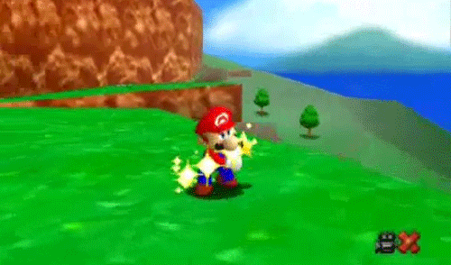
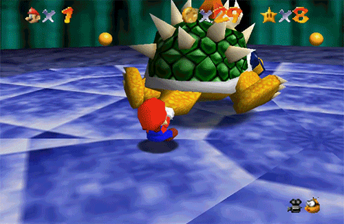

<h1 align="center">Felipe Beltrán</h1>

  <strong>Systems Engineering Student</strong> 

### About Me

I'm a Systems Engineering student with a strong interest in backend development, video game development, and IoT.

I enjoy designing logical solutions, building software from scratch, and exploring technologies that connect hardware and software. I'm always looking for opportunities to learn through projects, competitions, and research.

  

🏆 **Winner** — <a href="https://felipebeltran.itch.io/la-redencion-del-llanero" target="_blank">First Place, 1° Game Jam Unillanos 2025</a>

Member of the Interactive Technologies Research Group (SITI) — 2025–Present.

Diploma in Energy Transition:
"Energía que transforma hacia la SosTECnibilidad"
Universidad de los Llanos × Ecopetrol

### Technical Skills

### Languages

  
  
  
  

### IoT

  
  
  

### Databases

  
  

### Game Development

  
  
  
  

### Tools & DevOps

  
  
  
  

### Spoken Languages

  
  

### Current Focus

* **Cloud Computing** → Learning cloud infrastructure, deployment, distributed systems, and scalable applications.
* **Cybersecurity** → Exploring secure software development, networking, system security, and cybersecurity fundamentals.
* **IoT & Edge Computing** → Deepening my knowledge of embedded systems, IoT architectures, and edge computing.
* **Competitive Programming** → Improving problem-solving skills through algorithmic challenges and RPC competitions.
* **Game Development** → Continuing to build games and explore different aspects of game development.

  

Outside programming, I'm the **electric guitarist  of my band** 🎸.

### GitHub Activity

  <picture>
    <source media="(prefers-color-scheme: dark)"
            srcset="https://raw.githubusercontent.com/FelipeBeltranING/FelipeBeltranING/output/galaga-contribution-graph-dark.svg">
    <source media="(prefers-color-scheme: light)"
            srcset="https://raw.githubusercontent.com/FelipeBeltranING/FelipeBeltranING/output/galaga-contribution-graph.svg">
    
  </picture>

### Connect

  
  
  

